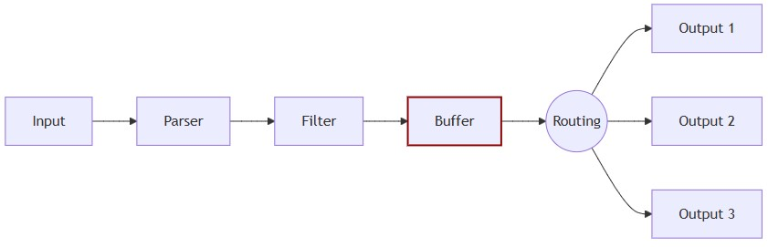

# 버퍼 관련 설정

- https://docs.fluentbit.io/manual/concepts/data-pipeline/buffer
- https://docs.fluentbit.io/manual/administration/backpressure
- https://docs.fluentbit.io/manual/administration/buffering-and-storage

## 개요

버퍼 관련 옵션을 보다 보면 헷갈리는 지점들이 있음

[INPUT]플러그인에서 `storage.type filesystem`설정으로 파일버퍼를 활성화시키는데 왜 파일버퍼 관련 튜닝옵션들은 [OUTPUT]플러그인에 모여있는가? 각각이 다른 파일버퍼인 것인가? 근데 왜 [INPUT]쪽엔 활성화 외에 디테일한 파일버퍼 튜닝옵션이 없는가?

## fluent-bit의 버퍼(큐) 특징

- fluent-bit의 데이터 처리 최소 단위는 청크이며 큐(Queue)를 통해서 처리한다.
- fluent-bit에선 memory 버퍼는 항상 존재하며, filesystem 버퍼 활성화시 secondary buffer로 파일시스템이 사용되는 개념
  - 파일버퍼가 활성화되어있어도 메모리버퍼 한도를 넘지 않는다면 메시지는 파일시스템을 거치지 않고 전송됨
  - fluentd와는 다른 지점임. fluentd는 메모리,파일 버퍼 중 하나만 선택하고 파일버퍼의 경우 정상처리되는 메시지도 반드시 파일시스템을 거쳐감.

## fluent-bit 파이프라인과 Buffer

- [Official Architecture](https://docs.fluentbit.io/manual/concepts/data-pipeline/buffer)
  
- memory든 filesystem이든 Buffer의 시스템 상 위치는 그림과 같이 OUTPUT 단계 직전에 있음
- Buffer는 별도 플러그인이 존재하지는 않고, 내부 엔진이 처리함.
- Buffer 설정은 [INPUT](주로 memory버퍼), Output(주로 filesystem버퍼), Service(전역설정) 플러그인에서 하게 됨
- 위 그림의 Buffer 자리에서 filesystem 버퍼는 Output 별로 존재 함. Output 플랫폼 별로 조건이 상이하기 때문에 전송실패시 안정성을 위한 filesystem 버퍼도 Output 별로 구분할 필요성이 있기 때문.
- 만약 멀티 Input인 경우, Buffer자리에 Input에서 설정한 tag에 따라서 별도 memory 버퍼가 존재 함.
- 이렇게 설계된 이유
  - 메모리와 파일버퍼 자리를 바꿔도 실제 수행에 문제는 없다.
  - 다만, 데이터 유실방지를 방지하기 위해 일반적으로 활용되는 것이 파일버퍼이고, 주로 OUTPUT 전송실패시 백프레셔 등으로 데이터유실 이슈가 발생하므로 파일버퍼를 secondary 버퍼로 뒷단에 두어 안정성을 강화한다.
  - fluent-bit는 적절한 속도로 로그 수집을 하면서 프로세스가 죽지 않아야 하는데 사실상 메모리와 직결된 문제이므로 메모리 버퍼를 primary 버퍼로 앞단에 두어 로그 수집 속도를 제어한다.

## [SERVICE]

- **storage.path /foo/bar/**
  - 파일버퍼 경로 지정
  - default: 없음
  - 파일버퍼 활성화를 위한 [SERVICE]에서 최소 필요 설정
- **storage.max_chunks_up 128**
  - 파일버퍼 활성화시, 메모리버퍼의 청크 개수 제한
  - default: 128
  - 파일버퍼 활성화시에만 적용됨 ([INPUT]에서 `storage.type filesystem`). 메모리버퍼 단독사용시 무시됨.
  - 설정된 청크 개수 초과시 파일버퍼로 넘어감 (메모리에 얼마나 "올릴 수 있느냐"이기 때문에 "up"이라고 표현)
  - **단일 청크의 크기는 약 2MB이며, 이는 fluent-bit 엔진 내부에서 관리. 커스텀X**
- **storage.backlog.mem_limit 5M**
  - 백로그 데이터 메모리 용량 제한
  - default: 5M
  - 파일버퍼 데이터를 다른 플랫폼으로 전송하려면, 파일버퍼를 메모리로 읽어야 하는데 이 때 한도를 설정하는 것
  - 장기간 전송 실패 등으로 파일버퍼에 누적량(backlog)이 많을 때, 한번에 메모리를 과점유하지 않기 위해 쓰는 옵션

## [INPUT]

- **storage.type memory**
  - 파일 버퍼 사용 여부 결정
  - default: memory
  - 값 예시
    - memory: 메모리버퍼만 사용
    - filesystem: 파일버퍼를 추가하여 사용(메모리 버퍼와 함께 동작함). 파일버퍼 활성화를 위한 [INPUT]에서 최소 필요 설정
- **Mem_Buf_Limit**
  - 메모리버퍼 총량 제한
  - default: 제한 없음
  - 값 예시: 500M,2G 등 용량기술
  - 메모리버퍼 단독 사용시에만 적용(`storage.type memory`). 파일버퍼 활성화시 무시됨.

### [INPUT-tail플러그인전용]

- **Buffer_Chunk_Size 32k**
  - 파일읽기 1회에 사용되는 메모리버퍼(1회에 읽는 양)
  - default: 32k
  - 클수록 read 횟수 줄어서 CPU 부하 감소 => read 성능 향상 => 대규모 데이터 처리시 유리(메모리 점유는 늘어남)
  - **TIP) 성능최적화에 쓸 수 있긴한데, 일반적으로 default로 두는 것 무방**
  - **이 옵션의 chunk는 tail 플러그인 전용 단위로, storage 관련 옵션에서 다루는 Fluent Bit 엔진의 청크와는 다르다. 여러 tail chunk가 모여 하나의 엔진 청크가 만들어진다.**
- **Buffer_Max_Size 32k**
  - 로그라인 1줄에 대한 용량 제한 (초과시 짤림)
  - default: 32k
  - **TIP) 기본값이 좀 부족한 감이 있음. 로그손실방지를 위해 기본 1M 맞춰두고 하는게 편했음**

## [OUTPUT]

- **storage.total_limit_size**
  - 목적지 별 파일 버퍼 총량 제한
  - default: 없음
  - 값 예시: 500M, 2G 등 용량 기술
  - 파일 버퍼 활성화 여부는 input에서 하지만, 크기 제한은 이 옵션으로 output에서 한다.
    - 동일 input에 여러 output이 있을 수 있으므로 개별 output에서 버퍼를 제어해야 함
  - 임계치 도달시 오래된 청크부터 삭제됨
